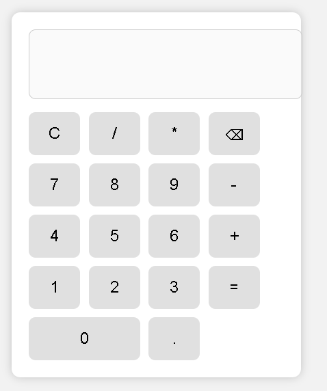

# Calculator Web App

A simple calculator built using HTML, CSS, and JavaScript.

## 🚀 Features

- Perform basic arithmetic operations
- Addition, Subtraction, Multiplication, Division
- Clear display
- Delete last input
- Responsive UI

## 🛠️ Technologies Used

- HTML
- CSS
- JavaScript

## 📂 Project Structure

calculator-project
│
├── index.html
├── style.css
├── script.js
└── README.md

## ▶️ How to Run

1. Download or clone the repository
2. Open `index.html` in your browser

## 🌐 Live Demo

https://OP0710.github.io/calculator-project

## 📸 Screenshot
## Screenshot

## 👨‍💻 Author

Naitiksingh Pingal
